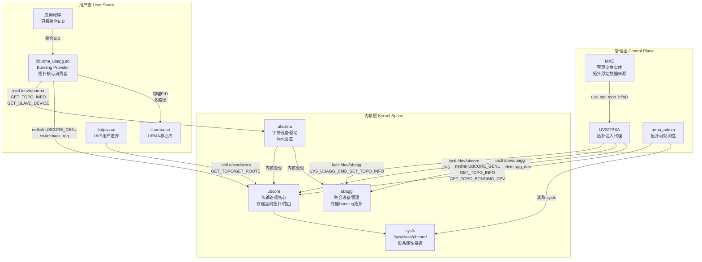
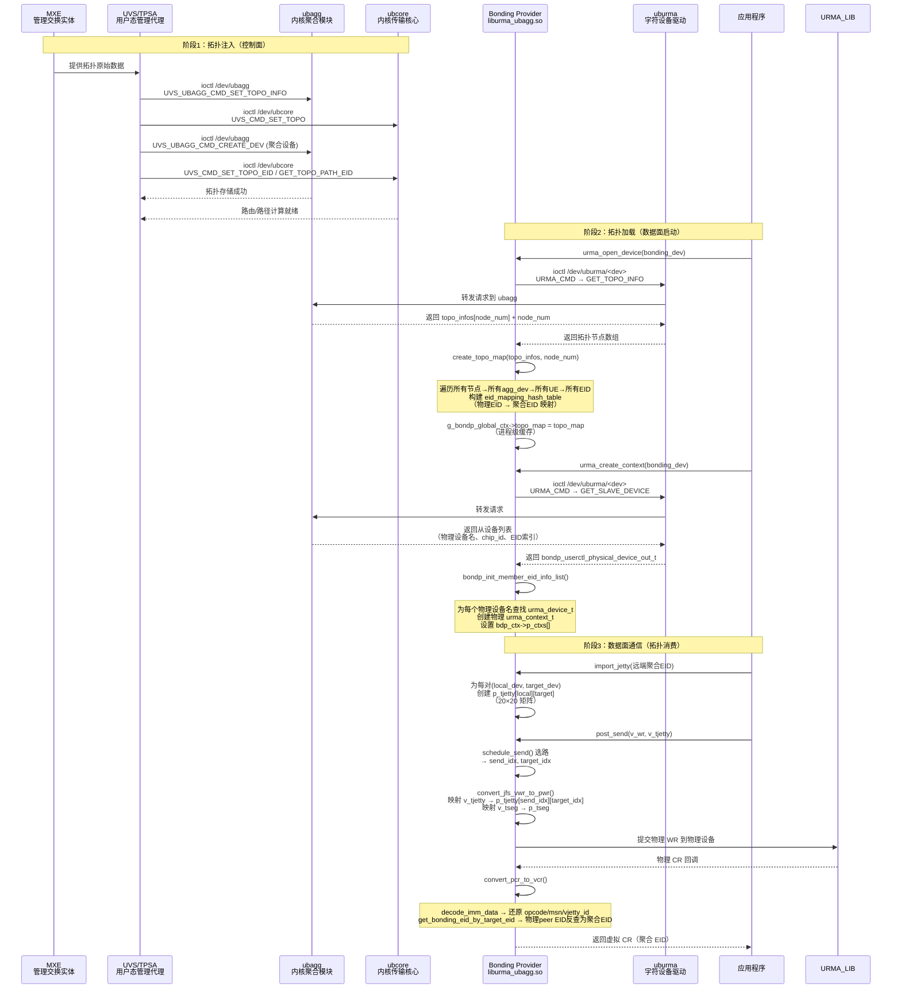
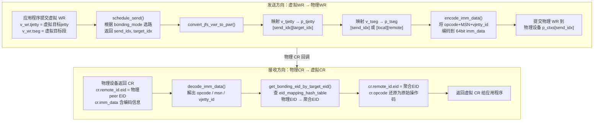
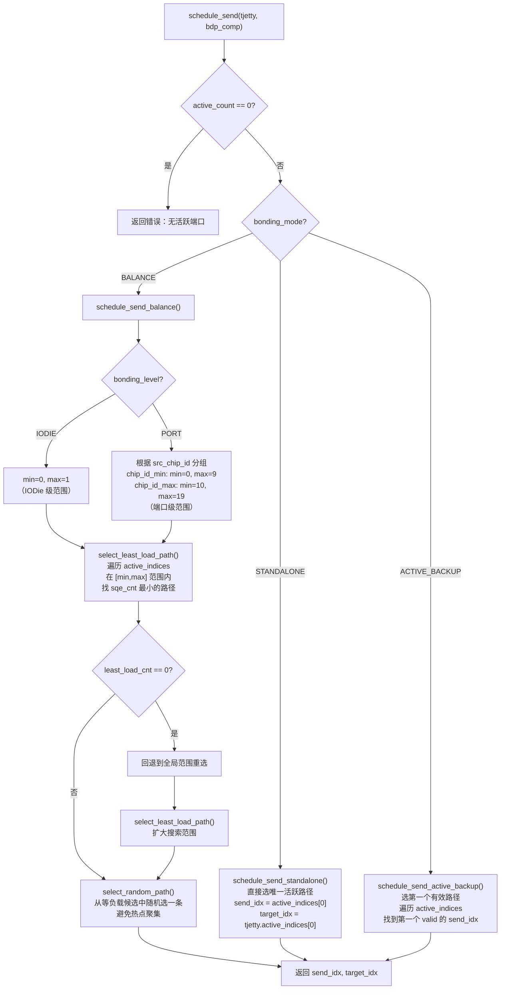
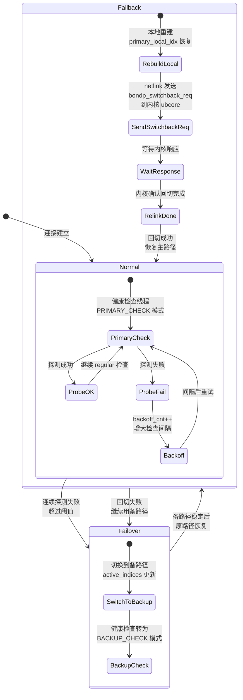
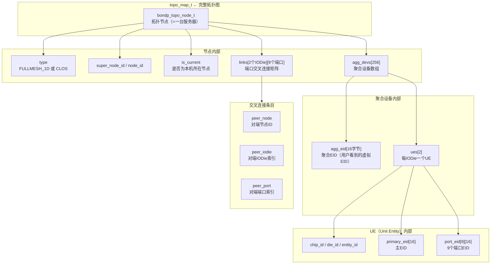

# URMA 网络拓扑架构概览

> 本文与 [URMA API Guide](../en/urma/URMA%20API%20Guide.md) 互补——API Guide 讲"怎么调用"，本文讲"拓扑系统怎么运转、为什么这样设计"。

## 本章导读

本章剖析 URMA 如何从底层获取网络拓扑信息，以及如何利用拓扑实现多路径 Bonding。读完本文你将建立以下认知：

1. 拓扑数据的原始来源与注入路径（MXE → UVS → 内核 → 用户态）
2. 拓扑数据结构的层次关系（节点→聚合设备→UE→端口EID）
3. 数据面如何利用拓扑完成"虚拟EID ↔ 物理EID"的透明转换
4. 多路径调度如何根据拓扑信息选路、故障切换

---

## 1. 分层架构设计

### 1.1 What：分层架构是什么？

UMDK 拓扑系统采用**管理面-内核-用户态三层架构**，拓扑数据自上而下注入、自下而上消费：

```
┌──────────────────────────────────────────────────────────────────┐
│                        管理面 (Control Plane)                      │
│  MXE (管理交换实体) ── 拓扑原始数据来源                              │
│  UVS/TPSA ── 拓扑注入代理，将 MXE 数据推入内核                      │
│  urma_admin ── 拓扑可观测性工具                                     │
├──────────────────────────────────────────────────────────────────┤
│                        内核层 (Kernel Space)                       │
│  ubcore ── 传输路径服务核心，存储全局拓扑、计算路由                     │
│  ubagg ── 聚合设备管理，存储 bonding 拓扑、提供从设备信息               │
│  uburma ── URMA 字符设备驱动，ioctl 通道                              │
│  sysfs ── /sys/class/ubcore/ 设备属性暴露                            │
├──────────────────────────────────────────────────────────────────┤
│                        用户态 (User Space)                         │
│  liburma_ubagg.so ── Bonding Provider，拓扑核心消费者                │
│  liburma.so ── URMA 核心库                                          │
│  libtpsa.so ── UVS/TPSA 用户态库                                    │
│  应用程序 ── 只看到聚合 EID，不感知物理拓扑                            │
└──────────────────────────────────────────────────────────────────┘
```

下面的分层架构图展示了各层间的通信通道：



### 1.2 Why：为什么这样分层？

**控制面与数据面分离**——这是整个架构的核心设计动机。MXE/UVS 作为控制面只负责"拓扑该是什么样"，Bonding Provider 作为数据面只负责"拓扑告诉我该怎么走"。两者不交叉：

- 如果让数据面自己发现拓扑，每次进程启动都要全网探测，延迟不可控
- 如果让控制面直接干预数据转发，管理面故障会导致数据面全面停摆
- 分离后，数据面只需从内核缓存读取拓扑（ioctl 一次，后续进程内缓存），管理面可以独立升级/重启而不影响正在运行的数据连接

**内核作为拓扑分发中介**——为什么拓扑不直接从 UVS 传给 Bonding Provider？因为内核同时服务 ubcore（路由计算）和 ubagg（从设备管理），它是最自然的"共享存储点"。用户态进程间直接共享内存需要复杂的同步机制，而内核 ioctl + sysfs 提供了标准化的访问接口。

### 1.3 How：各层如何协同？

拓扑信息的完整流转路径如下节时序图所示。核心协作机制是：

1. **注入阶段**：MXE → UVS → 内核（双向 ioctl 推入 ubagg + ubcore）
2. **加载阶段**：Bonding Provider → ioctl 从内核读取（进程级缓存）
3. **消费阶段**：数据面从缓存查哈希表，管理面从 sysfs/netlink 查询
4. **反馈阶段**：故障回切通过 netlink 反向通知内核

> 理解了分层架构后，接下来看具体组件如何在这些层中扮演角色。

---

## 2. 核心组件介绍

### 2.1 全局视角

| 组件 | 类比角色 | 核心职责 |
|------|---------|---------|
| MXE | 城市规划局 | 制定全网拓扑蓝图，知道每条路连接哪里 |
| UVS/TPSA | 施工队 | 将规划蓝图落实到道路系统（内核）中 |
| ubcore | 市交通管理中心 | 存储全市路网数据，计算两点间可行路线 |
| ubagg | 道路聚合管理站 | 管理"主干道"（聚合设备）和"支路"（物理设备）的绑定关系 |
| Bonding Provider | 出租车调度中心 | 根据路网信息为每次出行选路、切换、负载均衡 |
| urma_admin | 交通信息查询终端 | 让运维人员查看全网路况 |

### 2.2 UVS/TPSA —— 施工队

#### What：是什么？

UVS（Unified Virtual Switch）/ TPSA（Transport Path Service Agent）是用户态的管理代理库（`libtpsa.so`），核心定义位于 `src/urma/lib/uvs/core/include/uvs_api.h`。它提供拓扑注入、聚合设备创建/删除、路由和路径查询接口。

#### 内部结构

```
UVS/TPSA 内部结构
├── uvs_set_topo_info() → 将拓扑推入 ubagg + ubcore（双向 ioctl）
├── uvs_get_topo_info() → 从 ubcore 读取拓扑
├── uvs_create_agg_dev() → 通过 /dev/ubagg 创建聚合设备
├── uvs_delete_agg_dev() → 通过 /dev/ubagg 删除聚合设备
├── uvs_get_route_list() → 从 ubcore 查询两点间路由列表
└── uvs_get_path_set() → 从 ubcore 查询两点间路径集合
```

#### Why：为什么需要？

内核不知道"拓扑应该是什么样"——它只是一个执行者。需要有外部代理将管理面（MXE）的决策转化为内核可存储的数据。UVS 就是这个桥梁：它接收 MXE 的拓扑数据，翻译成内核 ioctl 格式，分别推入 `ubagg` 和 `ubcore`。

#### How：如何工作？

UVS 同时操作两个内核模块：
- `/dev/ubagg`（`UVS_UBAGG_CMD` 族）— 聚合设备管理和 bonding 拓扑存储
- `/dev/ubcore/ubcore`（`TPSA_CMD` 族）— 全局拓扑存储、路由和路径计算

> UVS 将蓝图落实后，接下来看内核如何存储和分发这些数据。

### 2.3 内核模块群 —— 道路基础设施

#### What：是什么？

三个内核模块构成拓扑的内核侧存储和计算基础设施：
- **ubcore**：存储全局拓扑节点数据，计算任意两个 EID 间的路由和路径集，通过 netlink 响应查询
- **ubagg**：管理聚合设备生命周期，存储 bonding 拓扑和从设备映射，通过 ioctl 提供从设备信息
- **uburma**：URMA 的字符设备驱动层，转发 Bonding Provider 的 ioctl 请求到 ubcore/ubagg

#### Why：为什么分成三个模块？

职责隔离——ubcore 负责"路网计算"（不关心聚合概念），ubagg 负责"主干道管理"（聚合设备抽象），uburma 负责"设备访问"（字符设备接口）。如果合并为一个模块，任何一方的变更都会影响整体稳定性。

#### How：如何对外暴露？

- **ioctl**：`/dev/uburma/<dev>`（`URMA_CMD`）、`/dev/ubcore/ubcore`（`TPSA_CMD`）、`/dev/ubagg`（`UVS_UBAGG_CMD`）
- **sysfs**：`/sys/class/ubcore/<dev>/` 下暴露设备属性、EID 列表、端口状态
- **netlink**：`UBCORE_GENL` 族，响应拓扑查询和 switchback 控制

> 内核准备好数据后，接下来看 Bonding Provider 如何消费这些数据。

### 2.4 Bonding Provider —— 出租车调度中心

#### What：是什么？

Bonding Provider（`liburma_ubagg.so`）是 URMA 的多路径聚合插件，核心定义位于 `src/urma/lib/urma/bond/` 目录。它将多个物理 UB 设备聚合为一个虚拟设备，对外暴露聚合 EID，内部管理物理路径的选路、故障切换和负载均衡。

#### 内部结构

```
Bonding Provider 内部结构
├── bondp_context_t → 虚拟上下文 + 物理上下文数组 + topo_map 指针
│   ├── v_ctx → 虚拟（聚合）URMA 上下文，用户直接操作的对象
│   ├── p_ctxs[20] → 最多20个物理设备上下文（每个对应一个真实 UB 设备）
│   ├── topo_map → 进程级拓扑缓存（从内核加载，含 EID 哈希映射表）
│   ├── bonding_mode → STANDALONE / ACTIVE_BACKUP / BALANCE
│   ├── bonding_level → IODIE级 / PORT级 聚合粒度
│   └── p_vjetty_id_table → 物理jetty ID → 虚拟jetty ID 映射
│
├── bondp_comp_t → 虚拟/物理组件对（JFS/JFR/Jetty 的聚合抽象）
│   ├── v_jfs/v_jfr/v_jetty → 虚拟组件（用户可见）
│   ├── p_jfs/p_jfr/p_jetty[20] → 物理组件数组（每个物理设备一份）
│   ├── active_indices / active_count → 当前活跃物理设备索引
│   ├── sqe_cnt[20] → 每条路径的发送队列深度（负载均衡依据）
│   └── msn → 消息序列号（CR 中编码虚拟 jetty ID）
│
├── bondp_target_jetty_t → 远端 jetty 的虚拟/物理映射
│   ├── v_tjetty → 虚拟目标 jetty（用户看到的聚合 EID）
│   ├── p_tjetty[20][20] → 物理目标 jetty 矩阵（local_dev × target_dev）
│   └── active_indices → 远端活跃设备索引
│
├── bondp_global_context_t → 进程级全局上下文
│   ├── topo_map → 全局拓扑缓存（所有上下文共享）
│   ├── enable_failover / enable_failback → 故障策略开关
│   └── health_thread_ctx → 健康检查线程
│
├── topo_info 模块 → 拓扑数据处理
│   ├── create_topo_map() → 从内核数据构建拓扑图 + EID 哈希映射
│   ├── get_bonding_eid_by_target_eid() → 物理EID → 聚合EID 反查
│   └── eid_mapping_hash_table → 哈希表（O(1) 查找）
│
├── bondp_datapath_convert → 数据面转换
│   ├── convert_jfs_vwr_to_pwr() → 虚拟WR → 物理WR（选路后映射）
│   ├── convert_pcr_to_vcr() → 物理CR → 虚拟CR（EID反查 + 解码）
│   └── encode/decode_imm_data() → 64bit立即数编码（CR opcode + MSN + vjetty_id）
│
├── bondp_datapath_schedule → 多路径调度
│   ├── schedule_send() → 发送路径选择（STANDALONE/ACTIVE_BACKUP/BALANCE）
│   ├── schedule_recv() → 接收路径选择
│   └── select_least_load_path() → 最小负载选择算法
│
├── bondp_health_check → 健康检查与故障切换
│   ├── bondp_health_task_t → 每对连接的健康检查任务
│   ├── bondp_fallback_task_t → 故障回切任务状态机
│   └── 健康检查线程 → 定期探测 + backoff + 自动切换
│
└── bondp_netlink → Netlink 通信
    ├── bondp_nl_send_switchback_req() → 发送故障回切请求
    └── bondp_nl_recv_switchback_msg() → 接收内核回切响应
```

#### Why：为什么需要 Bonding Provider？

没有 Bonding Provider 时，应用程序必须：
- 自己知道每个物理设备的 EID
- 自己决定发到哪个设备
- 自己处理设备故障后的切换
- 自己处理跨设备的完成记录归属

这相当于让每个应用都变成"网络调度器"——极其复杂且重复。Bonding Provider 将这些通用逻辑封装为"虚拟设备 + 聚合 EID"的抽象，应用只需关心"跟谁通信"，不用关心"走哪条路"。

#### How：如何工作？

核心工作流程在下节时序图中详述。简言之：
1. 上下文创建时加载拓扑 → 构建 EID 哈希映射
2. import_jetty 时创建 20×20 物理目标 jetty 矩阵
3. 发送 WR 时调度选路 → 转换虚拟 WR 为物理 WR → 提交到物理设备
4. 接收 CR 时反向转换 → 物理 EID 查哈希表还原为聚合 EID → 返回给应用

---

## 3. 拓扑加载时序图

下面的时序图展示了从 MXE 注入拓扑到 Bonding Provider 消费拓扑的完整流程：



从时序图可以看到三个关键阶段：

1. **注入阶段**：UVS 将 MXE 数据同时推入 ubagg 和 ubcore，确保两个内核模块的拓扑一致
2. **加载阶段**：Bonding Provider 通过两次 ioctl 获取完整拓扑（GET_TOPO_INFO + GET_SLAVE_DEVICE），构建进程级缓存
3. **消费阶段**：每次数据操作都经过 调度→转换→提交→反转换 的四步流程

---

## 4. 数据面 EID 转换流程

数据面最核心的机制是"虚拟 ↔ 物理"的双向转换。下面的流程图展示了发送和接收两个方向的转换路径：



**为什么需要两方向转换？**——因为物理设备只知道物理 EID，而应用程序只知道聚合 EID。发送时必须将"我要跟聚合 EID X 通信"翻译为"我要通过物理设备 A 跟物理 EID X-A 通信"；接收时必须将"来自物理 EID X-A 的回应"翻译回"来自聚合 EID X 的回应"。如果不做转换，应用会看到一堆陌生的物理 EID，无法将其与自己的通信对象对应。

**imm_data 编码机制**（`bondp_datapath_convert.c:112-169`）：64bit 立即数被压缩编码为 `cr_opcode(2bit) + msn(24bit) + vjetty_id(16bit) + user_data(20bit)`。这使得物理 CR 中能携带虚拟 jetty ID，从而在 `convert_pcr_to_vcr()` 中将 CR 正确归属到虚拟 jetty。

---

## 5. 多路径调度流程

Bonding Provider 支持三种调度模式，下面的流程图展示了发送路径选择逻辑：



**三种模式的设计动机**：

- **STANDALONE**：单路径场景（调试/测试），不需要调度逻辑
- **ACTIVE_BACKUP**：主备场景（高可靠），优先用主路径，主路径故障自动用备路径。简单可靠但吞吐量受限
- **BALANCE**：负载均衡场景（高吞吐），在多条路径间分散流量。`bonding_level` 控制粒度：
  - IODIE 级（0-1）：只在两个 IODie 间均衡，适合跨 die 大流量
  - PORT 级（0-19）：在最多 20 个端口间均衡，适合细粒度流量分散

**为什么用"最小负载 + 随机"而非纯轮询？**——轮询（Round-Robin）在路径数不均匀或部分路径故障时会产生偏斜。最小负载优先保证流量流向最空闲的路径，多条等负载时随机分散避免连续流量撞同一条路径。

---

## 6. 健康检查与故障切换

### 6.1 状态机

下面的状态图展示了健康检查和故障切换的状态流转：



**为什么设计"探测 → backoff → 切换 → 回切"的四级机制？**——
1. 探测（Probe）：持续监控，最早发现问题
2. Backoff：避免频繁探测加重故障设备的负担，指数退避
3. 切换（Failover）：确保通信不中断，快速转到备路径
4. 回切（Failback）：主路径恢复后回到最优路径（通过 netlink 通知内核重新分配资源）

回切通过 netlink（`UBCORE_GENL` 族）与内核协同，而非纯用户态操作——因为内核需要知道路径变更以重新配置传输通道。这是 `bondp_netlink.c:170-207` 的核心职责。

---

## 7. 拓扑数据结构详解

### 7.1 核心结构层次图

下面的图展示了拓扑数据从节点到端口 EID 的层次关系：



### 7.2 结构对应关系（三套平行定义）

UMDK 中有三套拓扑结构定义，结构完全相同但命名不同，分别服务于不同场景：

| 层面 | 节点结构 | 聚合设备 | UE | 用途 |
|------|---------|---------|-----|------|
| Bonding Provider | `bondp_topo_node_t` | `bondp_topo_agg_dev_t` | `bondp_topo_ue_t` | 数据面消费 |
| UVS API | `urma_topo_node` | `urma_topo_agg_dev` | `urma_topo_ue` | 管理面注入/查询 |
| Admin Tool | `tool_topo_info_t` | `tool_topo_agg_dev_t` | `tool_topo_ue_t` | 运维可观测 |

源码位置：
- Bonding: `src/urma/lib/urma/bond/utils/topo_info.h`
- UVS: `src/urma/lib/uvs/core/include/uvs_api.h`
- Admin: `src/urma/tools/urma_admin/admin_parameters.h`

### 7.3 EID 映射哈希表

`topo_map_t` 的核心是 `eid_mapping_hash_table`，它将**任意 EID**（聚合/主/端口）映射到其所属的**聚合 EID**：

```
eid_mapping_hash_table 构建过程 (create_topo_map → update_mapping_hash_table):

遍历: node[0..node_num-1] → agg_dev[0..255] → ue[0..1] → primary_eid + port_eid[0..8]

插入规则:
  agg_eid           → agg_eid (自映射)
  primary_eid       → agg_eid (主EID映射到聚合)
  port_eid[i]       → agg_eid (端口EID映射到聚合)

查找: get_bonding_eid_by_target_eid(topo_map, physical_eid, &output)
  → O(1) 哈希查找 → 返回聚合EID
```

**为什么需要自映射？**——当远端 peer 使用聚合 EID 发送时，物理 CR 中的 peer EID 可能就是聚合 EID 本身。自映射确保这种情况也能正确查找，不会误判为"找不到"。

---

## 8. 通信通道汇总

| 通道 | 字符设备/协议 | 命令族 | 使用者 | 主要操作 |
|------|-------------|--------|-------|---------|
| ioctl | `/dev/uburma/<dev>` | `URMA_CMD ('U')` | Bonding Provider | GET_TOPO_INFO, GET_SLAVE_DEVICE, 上下文/资源管理 |
| ioctl | `/dev/ubcore/ubcore` | `TPSA_CMD ('V')` | UVS/TPSA | SET/GET_TOPO, GET_TOPO_EID, GET_ROUTE, GET_PATH_SET |
| ioctl | `/dev/ubagg` | `UVS_UBAGG_CMD ('B')` | UVS/TPSA | CREATE/DELETE_DEV, SET_TOPO_INFO, ADD/RMV_DEV |
| netlink | `UBCORE_GENL` (v1) | Generic Netlink | Bonding Provider + urma_admin | switchback_req, GET_TOPO_INFO(cmd15), GET_TOPO_BONDING_DEV(cmd33) |
| sysfs | `/sys/class/ubcore/<dev>/` | 文件系统 | URMA core + urma_admin | 设备属性、EID列表、端口状态 |

---

## 9. 源码目录导航

推荐阅读路径（按理解顺序）：

```
src/urma/
├── lib/urma/bond/utils/topo_info.h     ← ① 拓扑数据结构定义（最先读）
├── lib/urma/bond/utils/topo_info.c     ← ② 拓扑图构建 + EID映射实现
├── lib/urma/bond/bondp_types.h         ← ③ Bonding核心类型（context/comp/tjetty）
├── lib/urma/bond/bondp_api.h           ← ④ Bonding对外API声明
├── lib/urma/bond/bondp_datapath_convert.c ← ⑤ 数据面虚拟↔物理转换（核心！）
├── lib/urma/bond/bondp_datapath_schedule.c ← ⑥ 多路径调度算法
├── lib/urma/bond/bondp_health_check.c  ← ⑦ 健康检查与故障切换
├── lib/urma/bond/bondp_netlink.c       ← ⑧ Netlink通信（switchback）
├── lib/urma/bond/bondp_context_table.h ← ⑨ p↔v jetty ID映射表
├── lib/uvs/core/include/uvs_api.h      ← ⑩ UVS管理面API
├── lib/urma/core/include/urma_types.h  ← ⑪ URMA基础类型（EID/jetty/tp）
├── lib/urma/bond/include/urma_ubagg.h  ← ⑫ Bonding私有类型/模式定义
└── tools/urma_admin/admin_netlink.c    ← ⑬ Admin工具netlink实现
```

---

## 本章总结

URMA 拓扑系统的核心设计思想是**"控制面注入、内核分发、数据面消费"**的三层分离：

- **控制面**（MXE + UVS）负责拓扑的制定和注入，不参与数据转发
- **内核**（ubcore + ubagg + sysfs）负责拓扑的存储、计算和标准化暴露
- **数据面**（Bonding Provider）负责拓扑的消费——选路、EID 转换、故障切换

| 关键知识点 | 核心要点 |
|-----------|---------|
| 拓扑来源 | MXE 通过 UVS ioctl 注入 ubagg + ubcore |
| 拓扑加载 | Bonding Provider ioctl GET_TOPO_INFO → create_topo_map → 进程级缓存 |
| EID 转换 | 发送：虚拟WR → 调度选路 → 映射物理组件；接收：物理CR → 哈希反查聚合EID |
| 多路径调度 | STANDALONE/ACTIVE_BACKUP/BALANCE 三模式，BALANCE 用最小负载+随机 |
| 故障切换 | 探测→backoff→failover→netlink switchback→failback 五步 |
| 数据结构 | node→agg_dev→UE→EID 四层，eid_mapping_hash_table O(1) 反查 |
| imm_data 编码 | 64bit = cr_opcode(2) + msn(24) + vjetty_id(16) + user_data(20) |

---

## 附录：名词 / 类 / 函数 / 方法 中文解释

### 核心名词

| 英文术语 | 中文解释 | 说明 |
|---------|---------|------|
| EID (Endpoint Identifier) | 端点标识符 | 16字节，标识 URMA 通信端点。类似 IP 地址但作用于灵衢总线网络 |
| Aggregation EID (agg_eid) | 聚合端点标识符 | Bonding 设备对外暴露的虚拟 EID，由多个物理 EID 聚合而成 |
| Primary EID (primary_eid) | 主端点标识符 | 每个 UE（Unit Entity）的主 EID，代表该 IODie 的默认通信端点 |
| Port EID (port_eid) | 端口端点标识符 | 每个 UE 的 9 个端口各有独立 EID，标识具体物理出口 |
| Jetty | 码头 | URMA 的通信端点对象，类似 RDMA 的 QP（Queue Pair），绑定到特定 EID |
| JFS (Jetty Flow Sender) | 码头流发送端 | 发送侧通信通道，类似 RDMA 的 Send Queue |
| JFR (Jetty Flow Receiver) | 码头流接收端 | 接收侧通信通道，类似 RDMA 的 Receive Queue |
| JFC (Jetty Flow Completion) | 码头流完成通道 | 完成事件队列，类似 RDMA 的 CQ（Completion Queue） |
| JFCE (Jetty Flow Completion Event) | 完成事件 | JFC 的异步事件通知机制 |
| TP (Transport Path) | 传输路径 | 底层物理传输通道，分 RTP(可靠)/CTP(连接)/UTP(不可靠) 三类 |
| CTP (Connection Transport Path) | 连接传输路径 | 有连接的可靠传输通道，用于 Jetty 通信 |
| RTP (Reliable Transport Path) | 可靠传输路径 | 无连接的可靠传输通道（类似 RDMA RC） |
| UTP (Unreliable Transport Path) | 不可靠传输路径 | 无连接不可靠传输（类似 RDMA UD） |
| IODie | IO晶粒 | 芯片中的 IO 处理单元，每个节点有 2 个 IODie（对应 2 个 chip） |
| UE (Unit Entity) | 单元实体 | 节点内一个 IODie 的通信实体，含 chip_id/die_id/entity_id + primary_eid + 9个port_eid |
| Aggregation Device (agg_dev) | 聚合设备 | 将多个物理设备聚合为一个虚拟设备的抽象，对外暴露 agg_eid |
| Bonding Device | 绑定设备 | 即聚合设备，在用户态通过 Bonding Provider 管理的多路径虚拟设备 |
| MXE (Management Exchange Entity) | 管理交换实体 | 外部管理面组件，提供全网拓扑原始数据 |
| UVS (Unified Virtual Switch) | 统一虚拟交换 | 用户态管理代理，将 MXE 拓扑注入内核 |
| TPSA (Transport Path Service Agent) | 传输路径服务代理 | 即 UVS 的另一命名，强调传输路径管理职责 |
| ubcore | 传输核心内核模块 | 存储全局拓扑、计算路由和路径集 |
| ubagg | 聚合内核模块 | 管理 Bonding 设备生命周期、存储 bonding 拓扑 |
| uburma | URMA字符设备驱动 | 提供 ioctl 接口给用户态 |
| WR (Work Request) | 工作请求 | 应用提交给 JFS/JFR 的操作请求（发送/读/写/原子操作） |
| CR (Completion Record) | 完成记录 | 操作完成后返回给应用的结果记录 |
| Segment (seg) | 内存段 | URMA 注册的内存区域，类似 RDMA 的 MR（Memory Region） |
| Token | 令牌 | 用于跨进程安全共享 Jetty/Segment 引用的安全令牌 |
| MSN (Message Sequence Number) | 消息序列号 | Bonding Provider 在 CR 中编码的序列号，用于跟踪消息归属 |
| Switchback | 故障回切 | 主路径故障切换到备路径后，主路径恢复时切回的操作 |
| Failover | 故障切换 | 当前路径故障时切换到备路径的操作 |
| Fallback | 回退 | 同 Failback/Failover 语境中的路径回退 |
| Backoff | 退避 | 健康检查探测失败后，增大检查间隔的策略（指数退避） |

### 核心数据结构（类/结构体）

| 结构体 | 中文解释 | 源码位置 | 核心字段说明 |
|--------|---------|---------|-------------|
| `topo_map_t` | 拓扑图 | `topo_info.h:73` | topo_infos[64]节点数组 + node_num + eid_mapping_hash_table（EID→聚合EID映射） |
| `bondp_topo_node_t` | 拓扑节点 | `topo_info.h:55` | type(拓扑类型) + node_id + is_current(本机标记) + links[2][9](连接矩阵) + agg_devs[256] |
| `bondp_topo_agg_dev_t` | 聚合设备 | `topo_info.h:50` | agg_eid[16] + ues[2](每IODie一个UE) |
| `bondp_topo_ue_t` | 单元实体 | `topo_info.h:34` | chip_id + die_id + entity_id + primary_eid[16] + port_eid[9][16] |
| `bondp_topo_link_t` | 连接条目 | `topo_info.h:44` | peer_node + peer_iodie + peer_port（描述本端口的远端连接对象） |
| `eid_mapping_entry_t` | EID映射条目 | `topo_info.h:67` | key_eid(任意EID) + bonding_eid(对应的聚合EID) + hmap_node(哈希表节点) |
| `bondp_global_context_t` | 进程级全局上下文 | `bondp_types.h:122` | pid + topo_map(全局拓扑缓存) + skip_load_topo + enable_failover/failback + health_thread_ctx |
| `bondp_context_t` | Bonding上下文 | `bondp_types.h:143` | v_ctx(虚拟上下文) + p_ctxs[20](物理上下文数组) + dev_num + bonding_mode/level + topo_map + p_vjetty_id_table |
| `bondp_comp_t` | 虚拟/物理组件聚合 | `bondp_types.h:214` | union{v_jfs/v_jfr/v_jetty}(虚拟) + union{p_jfs/p_jfr/p_jetty[20]}(物理) + active_indices + sqe_cnt[20] + msn |
| `bondp_target_jetty_t` | 远端目标jetty聚合 | `bondp_types.h:256` | v_tjetty(虚拟目标) + p_tjetty[20][20](物理矩阵) + local/target_active_indices |
| `bondp_tseg_t` | 目标段聚合 | `bondp_types.h:181` | v_tseg(虚拟目标段) + p_tseg[20](物理目标段数组) |
| `bondp_health_task_t` | 健康检查任务 | `bondp_types.h:76` | bdp_tjetty + bondp_jetty + mode(PRIMARY/BACKUP) + sub_tasks[20][20] + fallback_task |
| `bondp_fallback_task_t` | 回切任务 | `bondp_types.h:65` | pending/local_rebuilt/req_sent/resp_received/relink_done(五步状态) + req_seq |
| `urma_topo_node` | UVS拓扑节点 | `uvs_api.h:118` | 与 bondp_topo_node_t 同构，用于管理面注入 |
| `urma_topo_agg_dev` | UVS聚合设备 | `uvs_api.h:107` | 与 bondp_topo_agg_dev_t 同构 |
| `urma_topo_ue` | UVS单元实体 | `uvs_api.h:99` | 与 bondp_topo_ue_t 同构 |
| `uvs_route_t` | 路由条目 | `uvs_api.h:49` | src/dst EID + flag(rtp/ctp/utp可用位) + hops + chip_id |
| `uvs_path_set_t` | 路径集合 | `uvs_api.h:89` | topo_type + src/dst_node + chip/die_count + path_count + paths[16] |
| `uvs_path_t` | 单条路径 | `uvs_api.h:82` | src_port(chip/die/port) + dst_port + src_eid + dst_eid |
| `urma_eid_t` | 端点标识符 | `urma_types.h` | 16字节，union of IPv4-mapped IPv6 和 IPv6 地址 |
| `urma_jetty_id_t` | 码头标识符 | `urma_types.h` | eid + uasid(地址空间ID) + id(jetty编号) |
| `urma_tp_cfg_flag_t` | 传输路径配置标志 | `urma_types.h` | target + loopback + dca_enable + bonding(标记硬件走bonding表) |
| `bondp_port_id_t` | Bonding端口ID | `urma_ubagg.h:80` | chip_id + die_id + port_idx + reserved（标识具体物理出口） |
| `bondp_bonding_mode_t` | Bonding模式枚举 | `urma_ubagg.h:38` | STANDALONE(单路径) / ACTIVE_BACKUP(主备) / BALANCE(负载均衡) |
| `bondp_bonding_level_t` | Bonding粒度枚举 | `urma_ubagg.h:45` | IODIE(2路径级) / PORT(20路径级) |

### 核心函数/方法

| 函数 | 中文解释 | 源码位置 | 说明 |
|------|---------|---------|------|
| `uvs_set_topo_info()` | 设置拓扑信息 | `uvs_api.h:158` | 将 MXE 拓扑数据通过 ioctl 推入 ubagg + ubcore |
| `uvs_get_topo_info()` | 获取拓扑信息 | `uvs_api.h:165` | 从 ubcore ioctl 读取当前拓扑 |
| `uvs_create_agg_dev()` | 创建聚合设备 | `uvs_api.h:134` | 通过 /dev/ubagg ioctl 创建新的 Bonding 设备 |
| `uvs_delete_agg_dev()` | 删除聚合设备 | `uvs_api.h:140` | 通过 /dev/ubagg ioctl 删除 Bonding 设备 |
| `uvs_get_route_list()` | 获取路由列表 | `uvs_api.h:175` | 查询两个 EID 间的路由（最多16条） |
| `uvs_get_path_set()` | 获取路径集合 | `uvs_api.h:177` | 查询两个聚合 EID 间的路径集合 |
| `create_topo_map()` | 创建拓扑图 | `topo_info.c:123` | 从内核拓扑数据构建 topo_map_t + EID 哈希映射表 |
| `delete_topo_map()` | 删除拓扑图 | `topo_info.c:163` | 释放 topo_map 及其哈希表 |
| `get_bonding_eid_by_target_eid()` | 查聚合EID | `topo_info.c:171` | 任意 EID → 聚合 EID 哈希查找（O(1)） |
| `update_mapping_hash_table()` | 更新EID映射表 | `topo_info.c:85` | 遍历全部节点/设备/UE/EID，插入哈希表 |
| `bondp_create_jetty()` | 创建虚拟码头 | `bondp_api.h:41` | 在 Bonding 上下文上创建虚拟 jetty，内部创建 20 个物理 jetty |
| `bondp_import_jetty()` | 导入远端码头 | `bondp_api.h:47` | 导入远端聚合 jetty，创建 20×20 物理目标 jetty 矩阵 |
| `bondp_bind_jetty()` | 绑定码头 | `bondp_api.h:56` | 将虚拟 jetty 与虚拟目标 jetty 绑定 |
| `schedule_send()` | 发送调度 | `bondp_datapath_schedule.c:177` | 根据模式选择发送路径，返回 send_idx + target_idx |
| `schedule_recv()` | 接收调度 | `bondp_datapath_schedule.c:203` | 选择接收路径 |
| `select_least_load_path()` | 选最小负载路径 | `bondp_datapath_schedule.c:23` | 遍历活跃路径，找 sqe_cnt 最小的候选集 |
| `select_random_path()` | 随机选路径 | `bondp_datapath_schedule.c:51` | 从等负载候选中随机选一条 |
| `convert_jfs_vwr_to_pwr()` | 虚拟WR→物理WR | `bondp_datapath_convert.c:248` | 将虚拟发送请求映射到物理路径（选路后调用） |
| `convert_pcr_to_vcr()` | 物理CR→虚拟CR | `bondp_datapath_convert.c:414` | 物理完成记录反查聚合EID + 解码 imm_data |
| `encode_imm_data()` | 编码立即数 | `bondp_datapath_convert.c:142` | 将 opcode+MSN+vjetty_id+user_data 编码到 64bit |
| `decode_imm_data()` | 解码立即数 | `bondp_datapath_convert.c:158` | 从 64bit imm_data 解出各字段 |
| `bondp_fallback_ctrl_send_default()` | 发送回切控制 | `bondp_netlink.c:55` | 通过 netlink 向内核发送 switchback 请求 |
| `bondp_nl_send_switchback_req()` | Netlink发回切请求 | `bondp_netlink.c:170` | 构建 UBCORE_GENL netlink 消息发送 |
| `bondp_nl_recv_switchback_msg()` | Netlink收回切响应 | `bondp_netlink.c:209` | 接收内核 switchback 响应消息 |
| `bondp_nl_init()` | Netlink初始化 | `bondp_netlink.c:114` | 创建 nl_sock + genl_connect + resolve UBCORE_GENL |
| `get_topo_info_from_ko()` | 从内核获取拓扑 | Bonding Provider 内部 | ioctl GET_TOPO_INFO 获取拓扑节点数组 |
| `bondp_init_member_eid_info_list()` | 初始化从设备EID | Bonding Provider 内部 | ioctl GET_SLAVE_DEVICE 获取物理设备映射 |
| `urma_write_affinity()` | 亲和性写操作 | `urma_ubagg.h:136` | 指定 src/dst chip_id 的亲和性写操作 |

### 拓扑类型枚举

| 枚举值 | 中文解释 | 说明 |
|--------|---------|------|
| `UVS_TOPO_TYPE_FULLMESH_1D` | 全互联一维拓扑 | 所有节点间直连，无中间层级。适合小规模集群 |
| `UVS_TOPO_TYPE_CLOS` | Clos网络拓扑 | 多平面 Clos 网络，有中间交换层。适合大规模超节点 |
| `BONDP_BONDING_MODE_STANDALONE` | 单路径模式 | 只用一条物理路径，不做调度 |
| `BONDP_BONDING_MODE_ACTIVE_BACKUP` | 主备模式 | 主路径优先，故障切换到备路径 |
| `BONDP_BONDING_MODE_BALANCE` | 负载均衡模式 | 多路径间分散流量 |
| `BONDP_BONDING_LEVEL_IODIE` | IODie级聚合 | 在 2 个 IODie 间均衡（粗粒度） |
| `BONDP_BONDING_LEVEL_PORT` | 端口级聚合 | 在最多 20 个端口间均衡（细粒度） |
| `UVS_RTP` | 可靠传输路径类型 | 对应 URMA 的 RTP |
| `UVS_CTP` | 连接传输路径类型 | 对应 URMA 的 CTP |
| `UVS_UTP` | 不可靠传输路径类型 | 对应 URMA 的 UTP |

---

## 附录：与相关文档的关系

- **URMA API Guide** (`doc/en/urma/URMA API Guide.md`)：讲 API 怎么调用，本文讲拓扑系统怎么运转
- **URMA QuickStart Guide** (`doc/en/urma/URMA QuickStart Guide.md`)：快速上手，本文深入架构
- **UMDK README** (`README.md`)：整体组件介绍，本文聚焦 URMA 拓扑子系统

建议阅读顺序：README → QuickStart → API Guide → 本文档