1. 搞清楚工作流，熟练使用skills
2. 理解好修改的代码，启动时
3. CANN接口找到来源
4. 梳理初始化涉及的步骤信息
5. 初始化的时候网络拓扑信息是自发现还是用户输入
6. 外部传入的节点信息都有什么
7. 建立环的逻辑细节是什么
8. 为什么是建立环连接方式
9. 各个节点交换的信息同步了什么


10. 20260610代办事项
1.晚上可信C++专业级科目一考试
2.下午小组例会
3.上午进展例会
4.完成代码编译，理解编译流程
5.理解msccl++后续逻辑，做好讲解
首先部署视图下应该有两个，一个是交付模型，交付模型的核心元素是产品交付的软件包，交付模型负责描述系统各个offering（如特性，单板软件，安全补丁，基础包，licence，插件，服务，微服务，软件组件，外购件）的整体构成，包括没个offering是有哪些构建元素打包发布，每个offering的产品版本策略，交付，升级策略，系统的交付依赖关系和依赖方式等，
并发并行设计，要定义适合产品业务的进程划分和线程使用原则，比如不同信任等级的实现元素需要用不同的进程进行内存隔离。
在运行模型中经典需要考虑到的因素包括资源、权限、隔离、节能、运行态监控等。
运行交互分析，
描述系统的动态行为，基于架构强相关用例，从系统运行视角分析到实现元素粒度。
在运行模型中需要针对可信的重点功能场景，典型如安全韧性的重点场景展开设计，描述其交互过程。
WrqkeekRyzQRTfV6pSTAeDFz
## msccl++ 的拓扑信息获取主要通过以下几个途径：
1. 同节点判断 — TcpBootstrap::getNranksPerNode() (bootstrap.cc:434-451) 通过 allGather 交换所有 rank 的 IP 地址，IP 相同的 rank 被认为在同一节点上。
2. GPU NUMA 亲和性 — numa.cc 用 cudaDeviceGetPCIBusId 获取 GPU 的 PCI Bus ID，再从 /sys/bus/pci/devices/<busId>/numa_node 读 sysfs 得到 NUMA node，用于线程绑定优化。
3. IB 设备发现 — ib.cc 用 ibv_get_device_list 枚举系统上的 IB 设备，通过 ibv_query_device/ibv_query_port 查询端口状态、链路层类型(Ethernet/InfiniBand)、RDMA atomics 能力等。Transport::IB0-IB7 按索引映射到对应 IB 设备，也可通过 MSCCLPP_HCA_DEVICES 环境变量覆盖。
4. VF/Data Direct 检测 — 通过 sysfs (/sys/class/infiniband/<dev>/device/physfn) 判断是否为虚拟功能(VF)，通过 mlx5dv_get_data_direct_sysfs_path 检测 Data Direct 支持。
5. 网络接口选择 — Bootstrap 用 FindInterfaces/FindInterfaceMatchSubnet 自动发现可用的 TCP 网口。
与 NCCL 不同，msccl++ 没有显式的拓扑图计算，拓扑感知是隐式的：用户选择 Transport (同节点用 CudaIpc，跨节点用 IB)，NUMA 绑定由 numaBind 处理，算法选择通过 nRanksPerNode 和 worldSize 约束。

所以是需要用户调用时选择使用什么方式吗
+ Thought: 1.4s
是的，msccl++ 需要用户在创建连接时显式指定 Transport 类型。例如：
// 同节点：用 CudaIpc
auto conn = communicator.connect(EndpointConfig(Transport::CudaIpc), remoteRank, tag);

// 跨节点：用 IB0
auto conn = communicator.connect(EndpointConfig(Transport::IB0), remoteRank, tag);
用户需要自己判断 remoteRank 是否在同一节点（可通过 bootstrap->getNranksPerNode() 推断），然后选对应的 Transport。Python API 也是同样的模式。
不过，RegisteredMemory 注册时可以指定多种 Transport（如 CudaIpc | IB0），运行时会自动 fallback——同节点先尝试 CudaIpc，失败则退到 IB（见 registered_memory.cc:160-175）。这提供了一定程度的自动性，但连接本身仍需用户选择。

那么在初始化msccl++的时候每个rank之间如何通信需要用户来决定吗
+ Thought: 5.2s
分两个阶段：
1. Bootstrap 初始化（自动） — TcpBootstrap 用 TCP socket 完成 rank 发现、allGather 地址交换、barrier 同步等。用户只需提供 rank/nRanks 和 uniqueId（或 ip:port），通信方式是 TCP，无需选择。
2. 数据通信连接（用户选择） — 创建 Communicator 之后，调用 connect() 建立 CudaIpc/IB 连接时，需要用户决定用哪种 Transport。
所以初始化阶段（Bootstrap）是自动的 TCP 通信，但后续实际的数据通路需要用户根据拓扑手动选择。这也是 msccl++ 和 NCCL 的主要区别之一——NCCL 自动探测拓扑并选择路径，msccl++ 把控制权交给用户。

那为什么初始化的时候要建立rank的环形链接，为什么选择这种连接方式
+ Thought: 4.9s
从 bootstrap.cc 可以看到，环形连接只为 Bootstrap 的 allGather 和 broadcast 服务：
1. allGather (bootstrap.cc:454-476) — 环形算法：每步从左邻居收数据、向右邻居发数据，n-1 步完成。每步只涉及两个 peer，带宽利用率恒定，不随 rank 数增长而收敛。
2. barrier — 直接调用 allGather，无需额外机制。
3. broadcast (bootstrap.cc:478-510) — 环形传播，root 先发，逐 rank 传递。
选环形的原因：
- 简单可靠 — 每个 rank 只需维持两个连接（左邻居+右邻居），不管总 rank 数多少，连接数恒定为 2。
- 天然适合 allGather — ring allgather 是最优的线性算法，复杂度 O(n×size)，每步通信量等于单个 rank 的数据量，不会产生热点。
- Bootstrap 阶段无需高性能 — Bootstrap 只交换少量控制信息（SocketAddress、magic number 等），不是数据通路，ring 足够且最省资源。
对比树形(allGather 可以 log(n) 步但需要多连接)或全连接(n² 连接)，环形在 Bootstrap 这种轻量场景下是最佳平衡点——连接数最少、算法简洁、无中心瓶颈。

那么在后续运行的时候还是环形的吗，按理说用户代码运行的时候，通信肯定不是环形的，任何rank之间都有可能通信吧
+ Thought: 4.8s
对，运行时完全不是环形的。Bootstrap 的环形只用于初始化阶段的协调（地址交换、allGather、barrier）。
运行时的通信由用户自由决定：
- communicator.connect(EndpointConfig, remoteRank, tag) — 可以与任意 rank 建立连接
- 同一个 rank 可以和多个不同 rank 建立多条连接
- 每条连接独立选择 Transport（对 rank 0 用 CudaIpc，对 rank 3 用 IB0）
- 用 tag 区分同一对 rank 间的多条连接
例如一个 allreduce 实现，用户可以为每个 rank 建立 ring 连接做 reduce-scatter，再建立另一组 ring 连接做 allgather——这是用户定义的 ring，和 Bootstrap 的 ring 无关。也可以做 tree、mesh、任意拓扑，全由用户编排。
总结：Bootstrap ring = 初始化协调用的临时通道；运行时拓扑 = 用户完全自主决定。

##为什么是创建环形链接，不能是所有rank都和root建立链接，rank向root报道后，root告诉所有rank每个rank的信息不就行了吗
+ Thought: 33.1s
其实 msccl++ 已经用了你说的方案的一半——前半段确实是星形：
- 所有 rank 向 root 上报 ExtInfo（星形）
- root 收齐后把每个 rank 的右邻居地址发给它（还是星形）
你的想法完全可行：root 直接把全部 n 个地址表发给每个 rank，就不需要环形 allGather 了。但 msccl++ 没这么做，原因是：
Root 的负载压力。对比两种方案：
 	星形全分发
Root 发送量	n × n × sizeof(SocketAddress)
每个 rank 发送量	0
Root 连接数	收 n 个 + 发 n 个 = 2n
负载分布	Root 独扛所有分发
n 小的时候两种都行，但 n=128+ 时 root 要发送 128×128=16384 个地址，而环形 allGather 让每个 rank 只发 127 个地址，root 只发 128 个右邻居地址。负载从 root 转移到了所有 rank。
而且代码里已经考虑了这一点——bootstrap.cc:402-404：
if (nRanks_ > 128) {
  randomSleep(rank_);  // stagger connection times to avoid an overload of the root
}
当 rank 数超过 128 时还要 stagger 连接避免 root 过载，可见 root 已经是瓶颈了，再让它分发全量地址会更严重。
所以设计是：星形收集（轻量）+ 环形分发（分散负载），而非全程星形。


# mscclpp Port Channel 架构分析

> 本文档分析 mscclpp 在 NVIDIA GPU 上如何实现 Port Channel，涵盖设计动机、核心组件、CUDA 统一内存机制和完整通信流程。

---

## 1. 设计动机

### 1.1 跨进程 GPU 通信的挑战

在 GPU 集合通信中，kernel 只能访问**本进程本 GPU** 的内存。当需要向远端 GPU（不同进程）写入数据时，kernel 无法直接操作，必须通过 host 侧的 `Connection` 接口中转。

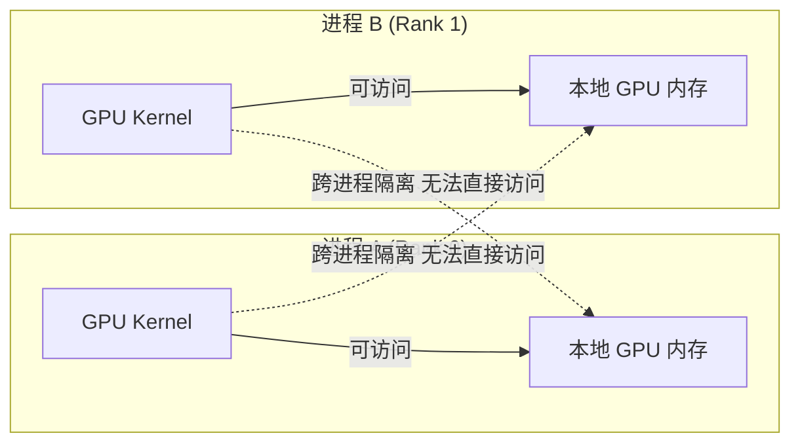

> **PlantUML 版本**（需专业渲染器）：
> ```plantuml
> @startuml 跨进程通信隔离
> skinparam backgroundColor #FFFFFF
> skinparam defaultFontSize 14
> 
> package "进程 A (Rank 0)" {
>   component [GPU Kernel] as kernelA
>   component [本地 GPU 内存] as memA
>   kernelA -right-> memA : 可访问
> }
> 
> package "进程 B (Rank 1)" {
>   component [GPU Kernel] as kernelB
>   component [本地 GPU 内存] as memB
>   kernelB -left-> memB : 可访问
> }
> 
> kernelA -[#red,dashed]-> memB : 跨进程隔离\n无法直接访问
> kernelB -[#red,dashed]-> memA : 跨进程隔离\n无法直接访问
> 
> note right of kernelA
>   kernel 只能访问
>   本进程本 GPU 的内存
> end note
> 
> note left of kernelB
>   跨进程通信需要
>   host 侧中转
> end note
> @enduml
> ```

### 1.2 Port Channel vs Memory Channel

| 特性 | Memory Channel | Port Channel |
|------|---------------|--------------|
| 通信方式 | kernel 直接读写远端 GPU 内存 | kernel 通过 FIFO 发号，host proxy 执行 |
| 适用场景 | 同进程多 GPU（CUDA IPC） | 跨进程 GPU（CUDA IPC / InfiniBand） |
| 性能 | 高（无 host 介入） | 中（host proxy 延迟） |
| 灵活性 | 低（kernel 直接操作） | 高（proxy 可执行复杂逻辑） |

---

## 2. 核心组件架构

### 2.1 整体架构图

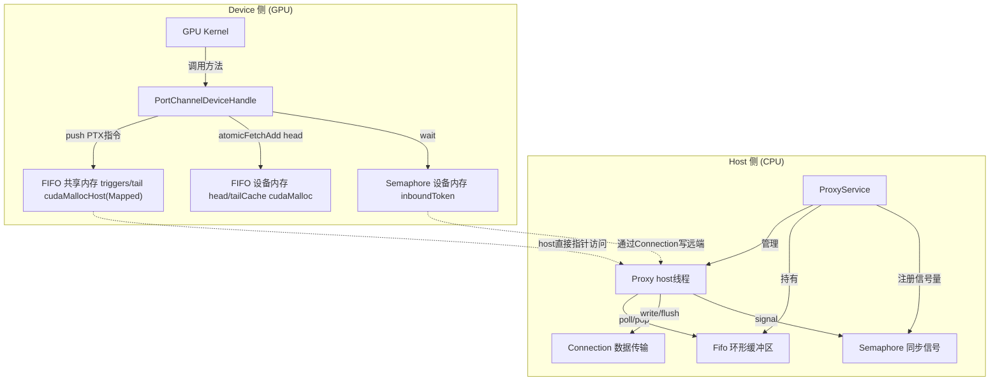

> **PlantUML 版本**（需专业渲染器）：
> ```plantuml
> @startuml 整体架构图
> skinparam backgroundColor #FFFFFF
> skinparam defaultFontSize 12
> skinparam componentStyle rectangle
> 
> package "Host 侧 (CPU)" {
>   component [ProxyService] as PS
>   component [Proxy\n(host线程)] as Proxy
>   component [Fifo\n(环形缓冲区)] as Fifo
>   component [Connection\n(数据传输)] as Conn
>   component [Semaphore\n(同步信号)] as Sema
> }
> 
> package "Device 侧 (GPU)" {
>   component [PortChannelDeviceHandle] as DHandle
>   component [GPU Kernel] as Kernel
>   component [FIFO 共享内存\n(triggers/tail)\ncudaMallocHost(Mapped)] as SharedFifo
>   component [FIFO 设备内存\n(head/tailCache)\ncudaMalloc] as DevFifo
>   component [Semaphore 设备内存\n(inboundToken)] as DevSema
> }
> 
> PS --> Proxy : 管理
> PS --> Fifo : 持有
> PS --> Sema : 注册信号量
> 
> Proxy --> Fifo : poll()/pop()
> Proxy --> Conn : write()/flush()
> Proxy --> Sema : signal()
> 
> DHandle --> SharedFifo : push() 通过 PTX 指令
> DHandle --> DevFifo : atomicFetchAdd(head)
> DHandle --> DevSema : wait()
> 
> Kernel --> DHandle : 调用方法
> 
> SharedFifo -[#Gray,dashed]-> Proxy : host 直接指针访问
> DevSema -[#Gray,dashed]-> Proxy : 通过 Connection 写远端
> @enduml
> ```

### 2.2 Host 侧类图

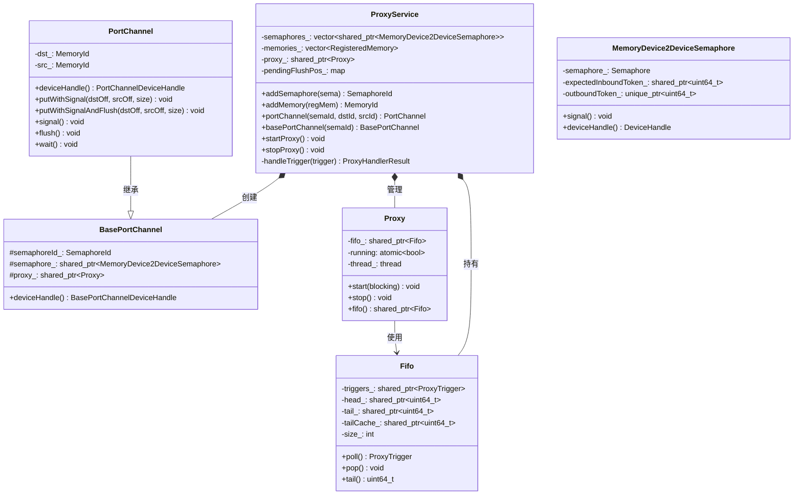

> **PlantUML 版本**（需专业渲染器）：
> ```plantuml
> @startuml Host侧类图
> skinparam backgroundColor #FFFFFF
> skinparam defaultFontSize 12
> skinparam classAttributeFontSize 11
> 
> class ProxyService {
>   - semaphores_: vector<shared_ptr<MemoryDevice2DeviceSemaphore>>
>   - memories_: vector<RegisteredMemory>
>   - proxy_: shared_ptr<Proxy>
>   - pendingFlushPos_: map
>   + addSemaphore(sema): SemaphoreId
>   + addMemory(regMem): MemoryId
>   + portChannel(semaId, dstId, srcId): PortChannel
>   + basePortChannel(semaId): BasePortChannel
>   + startProxy(): void
>   + stopProxy(): void
>   - handleTrigger(trigger): ProxyHandlerResult
> }
> 
> class BasePortChannel {
>   # semaphoreId_: SemaphoreId
>   # semaphore_: shared_ptr<MemoryDevice2DeviceSemaphore>
>   # proxy_: shared_ptr<Proxy>
>   + deviceHandle(): BasePortChannelDeviceHandle
> }
> 
> class PortChannel {
>   - dst_: MemoryId
>   - src_: MemoryId
>   + deviceHandle(): PortChannelDeviceHandle
>   + putWithSignal(dstOff, srcOff, size): void
>   + putWithSignalAndFlush(dstOff, srcOff, size): void
>   + signal(): void
>   + flush(): void
>   + wait(): void
> }
> 
> class Proxy {
>   - fifo_: shared_ptr<Fifo>
>   - running: atomic<bool>
>   - thread_: thread
>   + start(blocking): void
>   + stop(): void
>   + fifo(): shared_ptr<Fifo>
> }
> 
> class Fifo {
>   - triggers_: shared_ptr<ProxyTrigger>
>   - head_: shared_ptr<uint64_t>
>   - tail_: shared_ptr<uint64_t>
>   - tailCache_: shared_ptr<uint64_t>
>   - size_: int
>   + poll(): ProxyTrigger
>   + pop(): void
>   + tail(): uint64_t
> }
> 
> class MemoryDevice2DeviceSemaphore {
>   - semaphore_: Semaphore
>   - expectedInboundToken_: shared_ptr<uint64_t>
>   - outboundToken_: unique_ptr<uint64_t>
>   + signal(): void
>   + deviceHandle(): DeviceHandle
> }
> 
> ProxyService "1" *-- "0..*" BasePortChannel : 创建
> ProxyService "1" *-- "1" Proxy : 管理
> ProxyService "1" *-- "1" Fifo : 持有
> PortChannel --|> BasePortChannel : 继承
> Proxy "1" --> "1" Fifo : 使用
> @enduml
> ```

### 2.3 Device 侧类图

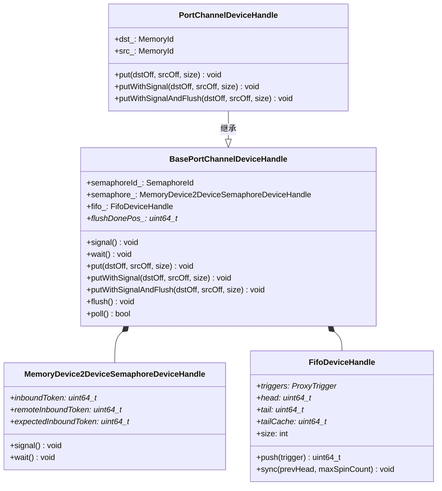

> **PlantUML 版本**（需专业渲染器）：
> ```plantuml
> @startuml Device侧类图
> skinparam backgroundColor #FFFFFF
> skinparam defaultFontSize 12
> skinparam classAttributeFontSize 11
> 
> class BasePortChannelDeviceHandle {
>   + semaphoreId_: SemaphoreId
>   + semaphore_: MemoryDevice2DeviceSemaphoreDeviceHandle
>   + fifo_: FifoDeviceHandle
>   + flushDonePos_: uint64_t*
>   + signal(): void
>   + wait(): void
>   + put(dstOff, srcOff, size): void
>   + putWithSignal(dstOff, srcOff, size): void
>   + putWithSignalAndFlush(dstOff, srcOff, size): void
>   + flush(): void
>   + poll(): bool
> }
> 
> class PortChannelDeviceHandle {
>   + dst_: MemoryId
>   + src_: MemoryId
>   + put(dstOff, srcOff, size): void
>   + putWithSignal(dstOff, srcOff, size): void
>   + putWithSignalAndFlush(dstOff, srcOff, size): void
> }
> 
> class MemoryDevice2DeviceSemaphoreDeviceHandle {
>   + inboundToken: uint64_t*
>   + remoteInboundToken: uint64_t*
>   + expectedInboundToken: uint64_t*
>   + signal(): void
>   + wait(): void
> }
> 
> class FifoDeviceHandle {
>   + triggers: ProxyTrigger*
>   + head: uint64_t*
>   + tail: uint64_t*
>   + tailCache: uint64_t*
>   + size: int
>   + push(trigger): uint64_t
>   + sync(prevHead, maxSpinCount): void
> }
> 
> PortChannelDeviceHandle --|> BasePortChannelDeviceHandle : 继承
> BasePortChannelDeviceHandle "1" *-- "1" MemoryDevice2DeviceSemaphoreDeviceHandle
> BasePortChannelDeviceHandle "1" *-- "1" FifoDeviceHandle
> @enduml
> ```

---

## 3. FIFO Ring Buffer

### 3.1 内存布局

FIFO 是大小为 512 的环形缓冲区，包含四个关键指针：

| 字段 | 分配方式 | 内存位置 | 用途 | 访问方 |
|------|---------|---------|------|--------|
| `triggers[512]` | `cudaMallocHost(cudaHostAllocMapped)` | 主机锁页内存 | 存储 trigger 数据 | kernel 写，proxy 读 |
| `head` | `cudaMalloc` | GPU 设备内存 (HBM) | FIFO 写指针（原子递增） | kernel 写 |
| `tail` | `cudaMallocHost(cudaHostAllocMapped)` | 主机锁页内存 | FIFO 读指针 | proxy 读写 |
| `tailCache` | `cudaMalloc` | GPU 设备内存 (HBM) | tail 的缓存副本 | kernel 读写 |

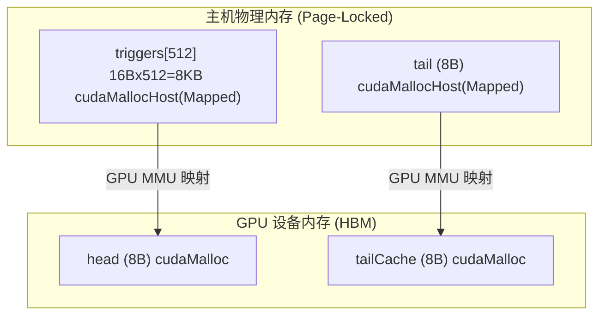

> **PlantUML 版本**（需专业渲染器）：
> ```plantuml
> @startuml CUDA_FIFO内存布局
> skinparam backgroundColor #FFFFFF
> skinparam defaultFontSize 12
> 
> package "主机物理内存 (Page-Locked)" {
>   component ["triggers[512]\n(16B x 512 = 8KB)\ncudaMallocHost(Mapped)"] as triggers
>   component ["tail (8B)\ncudaMallocHost(Mapped)"] as tail
> }
> 
> package "GPU 设备内存 (HBM)" {
>   component ["head (8B)\ncudaMalloc"] as head
>   component ["tailCache (8B)\ncudaMalloc"] as tailCache
> }
> 
> triggers -[#blue]-> head : GPU MMU 映射
> tail -[#blue]-> tailCache : GPU MMU 映射
> 
> note right of triggers
>   CUDA 特性:
>   cudaMallocHost(Mapped) 分配
>   映射进 GPU MMU 页表
>   GPU 虚拟地址 == 主机虚拟地址
>   kernel 可通过 PTX 指令直接访问
> end note
> @enduml
> ```

### 3.2 ProxyTrigger 结构体

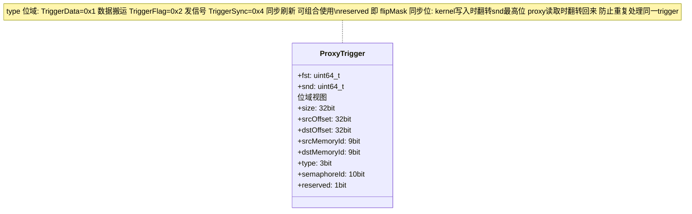

> **PlantUML 版本**（需专业渲染器）：
> ```plantuml
> @startuml ProxyTrigger结构
> skinparam backgroundColor #FFFFFF
> skinparam defaultFontSize 12
> 
> class ProxyTrigger {
>   + fst: uint64_t
>   + snd: uint64_t
>   ..
>   位域视图
>   + size: 32bit
>   + srcOffset: 32bit
>   + dstOffset: 32bit
>   + srcMemoryId: 9bit
>   + dstMemoryId: 9bit
>   + type: 3bit
>   + semaphoreId: 10bit
>   + reserved: 1bit
> }
> 
> note right of ProxyTrigger
>   type 位域:
>   TriggerData = 0x1  - 数据搬运
>   TriggerFlag = 0x2  - 发信号
>   TriggerSync = 0x4  - 同步刷新
>   可组合使用
>   ----
>   reserved 即 flipMask 同步位:
>   kernel 写入时翻转 snd 最高位
>   proxy 读取时翻转回来
>   防止重复处理同一 trigger
> end note
> @enduml
> ```

---

## 4. CUDA 统一内存机制

### 4.1 cudaMallocHost + cudaHostAllocMapped

mscclpp FIFO 能在 CUDA 上工作的核心：GPU kernel 可以直接通过 PCIe 写主机内存。

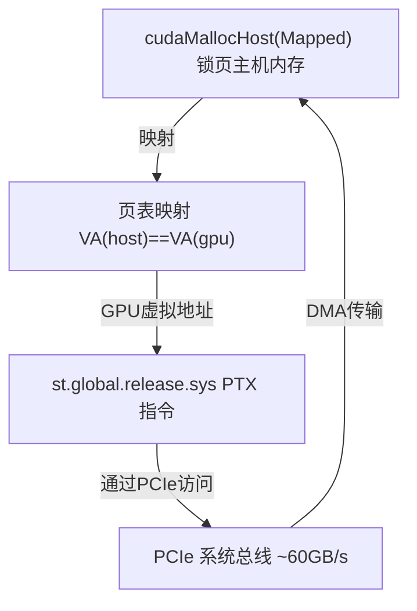

> **PlantUML 版本**（需专业渲染器）：
> ```plantuml
> @startuml CUDA统一内存机制
> skinparam backgroundColor #FFFFFF
> skinparam defaultFontSize 12
> 
> package "Host 物理内存" {
>   component ["cudaMallocHost(Mapped)\n锁页主机内存"] as hostMem
> }
> 
> package "GPU MMU 页表" {
>   component ["页表映射\nVA(host) == VA(gpu)"] as mmu
> }
> 
> package "GPU Kernel" {
>   component ["st.global.release.sys\nPTX 指令"] as ptx
> }
> 
> package "PCIe 系统总线" {
>   component ["~60 GB/s (PCIe 5.0 x16)"] as pcie
> }
> 
> hostMem -down-> mmu : 映射
> mmu -down-> ptx : GPU 虚拟地址
> ptx -down-> pcie : 通过 PCIe 访问
> pcie -up-> hostMem : DMA 传输
> 
> note right of hostMem
>   三要素:
>   1. 锁页内存 - 物理页不换出
>   2. MMU 映射 - GPU 页表有此内存项
>   3. PCIe 通道 - 通过系统总线访问
> end note
> @enduml
> ```

### 4.2 st.global.release.sys PTX 指令

```ptx
st.global.release.sys.v2.u64 [%0], {%1, %2}
```

| 修饰符 | 含义 |
|--------|------|
| `st` | store（写操作） |
| `.global` | 全局内存地址空间 |
| `.release` | release 语义，确保之前所有内存操作对远端可见 |
| `.sys` | 系统总线（PCIe），访问主机内存 |
| `.v2.u64` | 一次写两个 64 位值（fst + snd 共 16 字节） |

---

## 5. 通信时序

### 5.1 双向通信完整时序

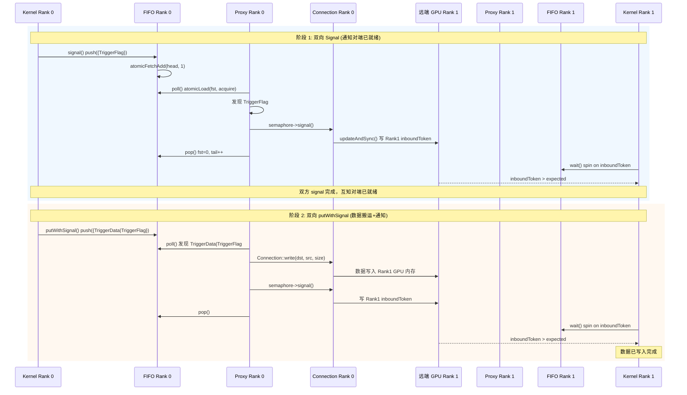

> **PlantUML 版本**（需专业渲染器）：
> ```plantuml
> @startuml mscclpp双向通信时序
> skinparam backgroundColor #FFFFFF
> skinparam defaultFontSize 12
> skinparam sequenceMessageAlign center
> 
> participant "Kernel\nRank 0" as K0
> participant "FIFO\nRank 0" as F0
> participant "Proxy\nRank 0" as P0
> participant "Connection\nRank 0" as C0
> participant "远端 GPU\nRank 1" as R1
> participant "Proxy\nRank 1" as P1
> participant "FIFO\nRank 1" as F1
> participant "Kernel\nRank 1" as K1
> 
> == 阶段 1: 双向 Signal (通知对端已就绪) ==
> 
> K0 -> F0: signal() push({TriggerFlag})
> F0 -> F0: atomicFetchAdd(head, 1)
> 
> P0 -> F0: poll() atomicLoad(fst, acquire)
> P0 -> P0: 发现 TriggerFlag
> P0 -> C0: semaphore->signal()
> C0 -[#green]-> R1: updateAndSync() 写 Rank1 inboundToken
> 
> P0 -> F0: pop() fst=0, tail++
> 
> K1 -> F1: wait() spin on inboundToken
> R1 --> K1: inboundToken > expected
> 
> note over K0, K1: 双方 signal 完成，互知对端已就绪
> 
> == 阶段 2: 双向 putWithSignal (数据搬运+通知) ==
> 
> K0 -> F0: putWithSignal() push({TriggerData|TriggerFlag})
> 
> P0 -> F0: poll() 发现 TriggerData|TriggerFlag
> 
> P0 -> C0: Connection::write(dst, src, size)
> C0 -[#blue]-> R1: 数据写入 Rank1 GPU 内存
> 
> P0 -> C0: semaphore->signal()
> C0 -[#green]-> R1: 写 Rank1 inboundToken
> 
> P0 -> F0: pop()
> 
> K1 -> F1: wait() spin on inboundToken
> R1 --> K1: inboundToken > expected
> 
> note over K1: 数据已写入完成
> @enduml
> ```

### 5.2 Proxy 线程循环

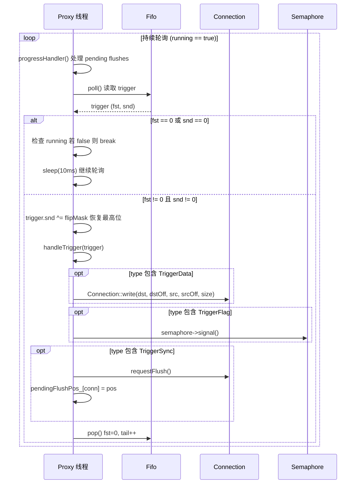

> **PlantUML 版本**（需专业渲染器）：
> ```plantuml
> @startuml Proxy线程循环
> skinparam backgroundColor #FFFFFF
> skinparam defaultFontSize 12
> 
> participant "Proxy 线程" as Proxy
> participant "Fifo" as Fifo
> participant "Connection" as Conn
> participant "Semaphore" as Sema
> 
> loop 持续轮询 (running == true)
>   Proxy -> Proxy: progressHandler() 处理 pending flushes
>   Proxy -> Fifo: poll() 读取 trigger
>   Fifo --> Proxy: trigger (fst, snd)
>   alt fst == 0 || snd == 0
>     Proxy -> Proxy: 检查 running 若 false 则 break
>     Proxy -> Proxy: sleep(10ms) 继续轮询
>   else fst != 0 && snd != 0
>     Proxy -> Proxy: trigger.snd ^= flipMask 恢复最高位
>     Proxy -> Proxy: handleTrigger(trigger)
>     alt type & TriggerData
>       Proxy -> Conn: Connection::write(dst, dstOff, src, srcOff, size)
>     end
>     alt type & TriggerFlag
>       Proxy -> Sema: semaphore->signal()
>     end
>     alt type & TriggerSync
>       Proxy -> Conn: requestFlush()
>       Proxy -> Proxy: pendingFlushPos_[conn] = pos
>     end
>     Proxy -> Fifo: pop() fst=0, tail++
>   end
> end
> @enduml
> ```

### 5.3 FIFO push 操作（Kernel 端）

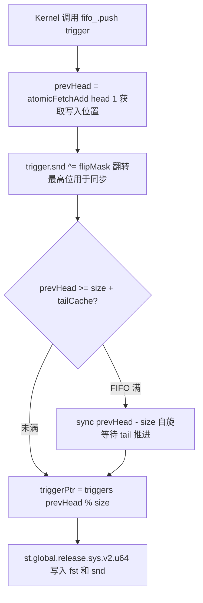

> **PlantUML 版本**（需专业渲染器）：
> ```plantuml
> @startuml Kernel_Push活动图
> skinparam backgroundColor #FFFFFF
> skinparam defaultFontSize 12
> 
> start
> 
> :kernel 调用 fifo_.push(trigger);
> 
> :prevHead = atomicFetchAdd(head, 1)
> 获取写入位置;
> 
> :trigger.snd ^= flipMask
> 翻转最高位用于同步;
> 
> if (prevHead >= size + *tailCache?) then (FIFO 满)
>   :sync(prevHead - size)
>   自旋等待 tail 推进;
> endif
> 
> :triggerPtr = triggers[prevHead % size];
> 
> :st.global.release.sys.v2.u64
> 写入 fst 和 snd;
> 
> stop
> @enduml
> ```

### 5.4 Semaphore 双向同步机制

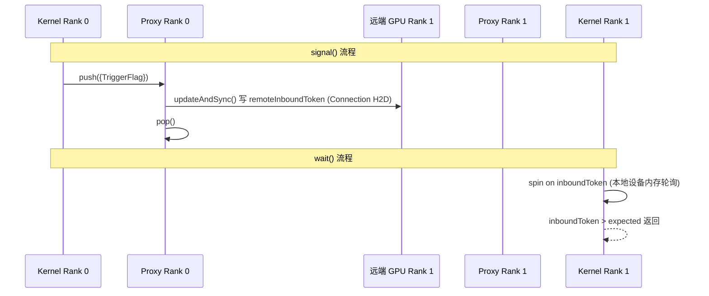

> **PlantUML 版本**（需专业渲染器）：
> ```plantuml
> @startuml Semaphore双向同步
> skinparam backgroundColor #FFFFFF
> skinparam defaultFontSize 12
> 
> participant "Kernel\nRank 0" as K0
> participant "Proxy\nRank 0" as P0
> participant "远端 GPU\nRank 1" as R1
> participant "Proxy\nRank 1" as P1
> participant "Kernel\nRank 1" as K1
> 
> note over K0, K1: signal() 流程
> 
> K0 -> P0: push({TriggerFlag})
> P0 -> R1: updateAndSync() 写 remoteInboundToken (Connection H2D)
> P0 -> P0: pop()
> 
> note over K0, K1: wait() 流程
> 
> K1 -> K1: spin on inboundToken (本地设备内存轮询)
> K1 --> K1: inboundToken > expected 返回
> @enduml
> ```

关键字段：
- `inboundToken` — 本端 semaphore 内存，对端写入，本端读取
- `remoteInboundToken` — 对端 semaphore 内存，本端写入，对端读取
- `expectedInboundToken` — 本端期望值，用于 wait() 自旋比较

---

## 6. 设计要点总结

1. **FIFO Ring Buffer** — kernel 和 proxy 之间的命令队列，使用 CUDA 统一内存实现共享
2. **ProxyTrigger 位域** — 16 字节紧凑设计，fst/snd 可原子读写，reserved 位用于 flipMask 同步
3. **三种 Trigger 类型** — Data/Flag/Sync 可组合，覆盖所有通信场景
4. **CUDA PTX 指令** — `st.global.release.sys` 通过 PCIe 写主机内存，是 FIFO 工作的核心
5. **Proxy 线程** — 持续轮询 FIFO，处理 trigger，执行 Connection 操作
6. **Semaphore 双向同步** — inboundToken/remoteInboundToken 实现 kernel 间双向通知
